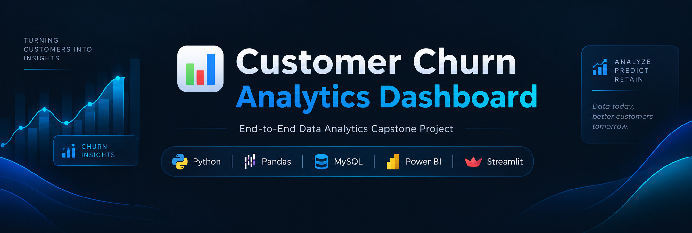

<div align="center">

# 📊 Customer Churn Analytics Dashboard

### End-to-End Data Analytics Capstone Project

**Python · Pandas · MySQL · Power BI · Streamlit**

[](https://www.python.org/)
[](https://pandas.pydata.org/)
[](https://www.mysql.com/)
[](https://powerbi.microsoft.com/)
[](https://streamlit.io/)

<br>



<br>

[](https://churn-capstone-project-thsxx3qzhbjx36nijgliaq.streamlit.app/)

</div>

---

## 📌 Project Overview

**Customer Churn Analytics** is an end-to-end data analytics project built around a telecom customer churn dataset.

The project demonstrates a complete analytics workflow — from **raw data cleaning and exploratory analysis** to **SQL-based business analysis, Power BI visualization, and Streamlit deployment**.

The goal is to transform customer-level telecom data into actionable business insights that can help a company understand:

- Which customer segments have higher churn
- How contract type relates to churn
- How internet service and payment method relate to churn
- Which retained customers have high churn risk
- How customer tenure and monthly charges relate to churn
- Which dimensions should be monitored to improve customer retention

> **Project type:** Data Analytics / Business Intelligence / End-to-End Portfolio Project  
> **Dataset:** Telco Customer Churn  
> **Primary tools:** Python, Pandas, MySQL, Power BI, Streamlit

---

## 🎯 Business Problem

Customer churn is a major business problem for subscription-based companies.

Instead of looking only at the total number of customers who leave, this project analyzes **why and where churn occurs** across multiple customer attributes.

### Key business questions

1. What percentage of customers have churned?
2. Which contract type has the highest churn?
3. How does churn vary by internet service?
4. Which payment methods are associated with higher churn?
5. Does customer tenure relate to churn?
6. How do monthly charges differ between churned and retained customers?
7. Which cities or regions show higher churn?
8. Does paperless billing relate to churn?
9. Which customer segments require closer retention attention?
10. Which retained customers have a high churn score?

---

# 🔄 End-to-End Project Workflow

```text
Raw Dataset
     │
     ▼
Data Cleaning
(Python + Pandas)
     │
     ▼
Exploratory Data Analysis
(Pandas + Visualization)
     │
     ▼
Business Analysis
(MySQL)
     │
     ▼
Interactive Dashboard
(Power BI + DAX)
     │
     ▼
Analytics Web App
(Streamlit + Plotly)
     │
     ▼
GitHub + Streamlit Deployment
```

---

# 🧰 Tech Stack

| Technology | Purpose |
|---|---|
| **Python** | Data processing and analysis |
| **Pandas** | Data cleaning, transformation and analysis |
| **NumPy** | Numerical operations |
| **Matplotlib / Seaborn** | Exploratory data visualization |
| **MySQL** | Business-oriented SQL analysis |
| **Power BI** | Interactive dashboard and DAX analysis |
| **Plotly** | Interactive charts in Streamlit |
| **Streamlit** | Web-based analytics application |
| **Jupyter Notebook** | Data cleaning and EDA workflow |
| **Git / GitHub** | Version control and project hosting |

---

# 📂 Dataset

The project uses the **Telco Customer Churn** dataset.

The dataset contains customer-level information covering areas such as:

- Customer demographics
- Contract information
- Internet service
- Payment method
- Tenure
- Monthly charges
- Total charges
- Churn status
- Churn score
- Customer lifetime value (CLTV)
- Location information

The cleaned project dataset contains approximately **7,043 customer records and 33 columns**.

---

# 🧹 1. Data Cleaning

The raw dataset was cleaned using **Python and Pandas** before performing analysis.

### Main cleaning activities

- Inspected dataset shape and data types
- Checked missing values
- Checked duplicate records
- Standardized column names / values where required
- Converted numerical fields to appropriate data types
- Handled invalid or missing values
- Checked categorical consistency
- Created/used churn-related analytical fields
- Exported the cleaned dataset for downstream analysis

### Example workflow

```python
import pandas as pd
import numpy as np

df = pd.read_csv("Telco-Customer-Churn.csv")

df.head()
df.shape
df.info()
df.isna().sum()
df.duplicated().sum()
```

The cleaned dataset is stored as:

```text
Cleaned_Churn.csv
```

---

# 🔎 2. Exploratory Data Analysis

EDA was performed to identify patterns and relationships in the customer data.

### Areas analyzed

- Overall churn distribution
- Churn by contract
- Churn by internet service
- Churn by payment method
- Churn by gender
- Churn by senior-citizen status
- Churn by paperless billing
- Churn by tenure
- Monthly charges vs churn
- Customer lifetime value
- Geographic/customer segment patterns

### Example Pandas analysis

```python
pd.crosstab(
    df["Contract"],
    df["Churn Label"]
)
```

```python
df.groupby("Churn Label")["Tenure Months"].mean()
```

```python
pd.crosstab(
    df["Payment Method"],
    df["Churn Label"],
    normalize="index"
) * 100
```

---

# 🗄️ 3. SQL Business Analysis

The cleaned data was loaded into **MySQL Workbench** for business-oriented querying.

The project includes **12+ SQL business queries**, covering:

### Core analysis

- Overall churn rate
- Churn by contract
- Churn by internet service
- Churn by payment method
- Churn by gender and senior-citizen status
- Churn by city
- Churn by paperless billing
- Contract + internet-service combinations
- Above-average churn segments

### Advanced SQL

The project also demonstrates:

- `GROUP BY`
- `HAVING`
- Aggregate functions
- Subqueries
- Common Table Expressions (CTEs)
- Window functions
- `RANK()`
- Conditional filtering
- Business-oriented segmentation

### Example

```sql
SELECT
    Contract,
    COUNT(*) AS Total_Customers,
    SUM(`Churn Value`) AS Churned,
    ROUND(
        AVG(`Churn Value`) * 100,
        2
    ) AS Churn_Rate
FROM cleaned_churn
GROUP BY Contract
ORDER BY Churn_Rate DESC;
```

Full SQL analysis is available in:

```text
SQL Queries.sql
```

---

# 📊 4. Power BI Dashboard

The project includes a Power BI dashboard designed to convert analytical results into business-friendly visualizations.

### Dashboard areas

- Customer overview
- Churn KPIs
- Contract analysis
- Churn distribution
- Internet service analysis
- Payment method analysis
- Regional/customer analysis
- Customer risk indicators
- Interactive filtering

### Power BI capabilities used

- Power Query
- DAX measures
- KPI cards
- Bar charts
- Pie/donut charts
- Filters and slicers
- Interactive dashboard design

### Dashboard Preview

> Add your Power BI screenshots to the repository using the filenames below.

```text
Customer Churn Dashboard (Part1).png
Customer Churn Dashboard (Part2).png
```

Then uncomment the following Markdown if you want the screenshots displayed here:

```markdown


```

---

# 🚀 5. Streamlit Analytics Application

The project was converted into an interactive Streamlit application so users can explore the analysis through a web interface.

### Application sections

| Section | Purpose |
|---|---|
| 📈 Overview | KPIs, dataset preview and overall churn |
| 🔍 Churn Analysis | Contract, service, payment and customer-risk analysis |
| 📊 Power BI Dashboard | Displays Power BI dashboard screenshots |
| 🗄️ SQL Queries | Presents business SQL queries and insights |
| 📁 Project Info | Project documentation and technology stack |

### Streamlit features

- Interactive tabs
- KPI metrics
- Plotly charts
- Data tables
- SQL query sections
- Power BI dashboard integration
- Responsive layout
- Cached dataset loading
- GitHub-based deployment

---

# 📈 Key Analytical Findings

Based on the analysis implemented in the project:

### Overall churn

The project calculates the overall churn rate from the `Churn Value` field.

The current analysis reports an overall churn rate of approximately:

**26.54%**

### Contract

Contract type is one of the major dimensions analyzed, with **month-to-month customers showing substantially higher churn than longer-term contract groups** in the project analysis.

### Internet Service

The analysis compares churn across internet-service categories and is used in both the SQL analysis and Streamlit dashboard.

### Payment Method

Payment method is analyzed as another customer-behavior dimension to identify segments with different churn rates.

### Customer Risk

The project identifies a high-risk retained-customer segment using:

```text
Churn Label = No
Churn Score >= 70
Contract = Month-to-month
```

These customers can be treated as a potential retention-analysis segment.

> **Important:** These findings are descriptive results from the project dataset. They show associations in the analyzed data and should not automatically be interpreted as causal relationships.

---

# 💡 Business Recommendations

Based on the analytical patterns identified in the project, a business could investigate:

### 1. Focus on month-to-month customers

Longer-term contract options, retention offers, or targeted engagement can be evaluated for customers showing elevated churn risk.

### 2. Monitor high-risk retained customers

Customers with high churn scores can be prioritized for further retention analysis.

### 3. Investigate payment behavior

Payment-method segments with higher churn should be analyzed further to understand whether payment experience, pricing, or customer characteristics contribute to the pattern.

### 4. Analyze early-tenure customers

Tenure analysis can help identify whether customers are more vulnerable to churn during the early stages of their relationship.

### 5. Use customer segmentation

Combining contract, service, payment, tenure, charges and churn score can provide more useful customer segments than analyzing any single variable independently.

---

# 🗂️ Project Structure

```text
Churn-Capstone-Project/
│
├── 📄 app.py
│
├── 📊 Cleaned_Churn.csv
├── 📊 Telco-Customer-Churn.csv
│
├── 🖼️ Customer Churn Dashboard (Part1).png
├── 🖼️ Customer Churn Dashboard (Part2).png
│
├── 📓 Data Cleaning.ipynb
├── 📓 EDA Analysis.ipynb
│
├── 🗄️ SQL Queries.sql
│
├── 📋 requirements.txt
│
├── 📁 assets/
│   └── dashboard_header.png
│
└── 📄 README.md
```

---

# 📚 What This Project Demonstrates

This project demonstrates how a real-world **business problem can be taken from raw customer data to a complete, interactive analytics solution**. It combines data preparation, exploratory analysis, SQL business intelligence, dashboard development, and application deployment into one end-to-end portfolio project.

### 🔗 Live Streamlit Application

The completed analytics application has been **deployed on Streamlit Cloud** and is available here:

**👉 [Open the Live Customer Churn Analytics Dashboard](https://churn-capstone-project-thsxx3qzhbjx36nijgliaq.streamlit.app/)**

The deployed application brings together the project's key outputs in one place, including the overview metrics, churn analysis, Power BI dashboard previews, SQL business queries, and project documentation.

### Python & Pandas

- Loading and inspecting real-world tabular data
- Data cleaning and validation
- Missing-value and duplicate checks
- Data type handling and transformation
- Filtering, grouping and aggregation
- Business-focused exploratory data analysis
- Creating analytical fields for churn analysis

### Exploratory Data Analysis

- Identifying churn patterns across customer segments
- Comparing churned and retained customers
- Studying contract, tenure, service and payment behavior
- Using statistical summaries and visualizations to communicate patterns
- Translating analytical observations into business questions

### SQL & Business Intelligence

- Writing business-oriented SQL queries
- `GROUP BY` and aggregate analysis
- `HAVING` and conditional filtering
- Subqueries
- Common Table Expressions (CTEs)
- Window functions and `RANK()`
- Customer segmentation and risk analysis
- Converting business questions into measurable SQL queries

### Power BI

- Building a business-focused dashboard
- Power Query transformations
- DAX measures
- KPI cards and visual analytics
- Interactive filters and slicers
- Presenting churn patterns for business users

### Streamlit

- Converting analysis into an interactive web application
- Creating multi-section/tabbed dashboards
- Displaying KPIs, tables and Plotly visualizations
- Integrating Power BI dashboard screenshots
- Presenting SQL analysis inside an accessible analytics interface
- Deploying the completed project to Streamlit Cloud

### GitHub & Portfolio Development

- Organizing an end-to-end analytics repository
- Maintaining notebooks, datasets, SQL scripts and application code
- Documenting the complete project workflow
- Publishing the project as a portfolio-ready GitHub repository

### End-to-End Analytics Thinking

Most importantly, this project demonstrates the ability to connect individual tools into one workflow:

```text
Raw Customer Data
       ↓
Data Cleaning
       ↓
Exploratory Data Analysis
       ↓
SQL Business Analysis
       ↓
Power BI Dashboard
       ↓
Streamlit Analytics Application
       ↓
GitHub Portfolio + Cloud Deployment
```

The result is not just a collection of charts or SQL queries, but a **complete analytics solution designed to turn customer data into business insights**.

---

# 🔮 Future Enhancements

Possible next versions of the project could include:

- [ ] Machine-learning churn prediction
- [ ] Customer segmentation using clustering
- [ ] Automated data pipeline
- [ ] Real-time database connection
- [ ] Automated model retraining
- [ ] Customer-level recommendation engine
- [ ] Email/alert system for high-risk customers
- [ ] Streamlit filters for city, contract and service
- [ ] Interactive customer-level drill-down
- [ ] Cloud database integration
- [ ] Automated dashboard refresh

---

# 🏆 Portfolio Value

This project is designed to demonstrate an **end-to-end analytics workflow**, rather than only showing isolated Python or SQL exercises.

It connects:

```text
Data Cleaning
      +
EDA
      +
SQL
      +
Power BI
      +
Streamlit
      +
GitHub
```

This makes the project suitable as a portfolio project for **Data Analyst / BI Analyst / Junior Analytics** roles.

---

# 👨‍💻 Author

<div align="center">

### Akshat Pandey

**B.Tech Computer Science Engineering**  
Vishwakarma University, Pune

📊 Data Analytics | Python | SQL | Power BI | Streamlit

</div>

---

# ⭐ If You Found This Project Useful

If this project helped you understand an end-to-end data analytics workflow, consider giving the repository a ⭐ on GitHub.

---

## 📄 License

This project is intended for educational and portfolio purposes.

---

<div align="center">

**Built with Python · Pandas · MySQL · Power BI · Streamlit**

</div>
